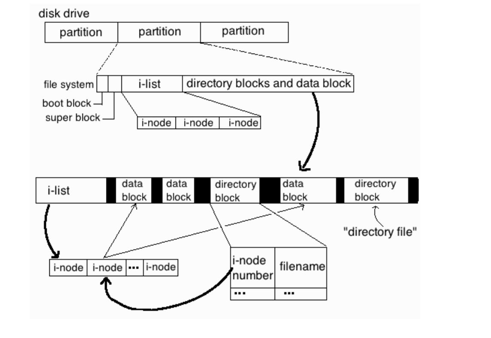

# Essential Commands

## Log into local & remote graphical and text mode consoles

Basic concept to know:

* **Text Terminal**: text input/output environment.
  * Originally, they meant a piece of equipment through which you could interact with a computer: in the early days of Unix, that meant a teleprinter-style device resembling a typewriter, sometimes called a teletypewriter, or “tty” in shorthand
  * Tty were used to establish a connection to a mainframe computer and share operating system provided by it
  * A typical text terminal produces input and displays output and errors
* **Console**: terminal in modern computers that don't use mainframe but have an own operating system. It is generally a terminal in the physical sense that is, by some definition, the primary terminal directly connected to a machine. 
  * The console appears to the operating system "like" a remote terminal
  * In Linux and FreeBSD, the console, in realty, appears as several terminals (*ttys*) called *Virtual Consoles*
* **Virtual Consoles**: to provide several text terminals on a single computer
  * Multiple virtual consoles can be accessed simultaneously
* **Shell**: command line interface or CLI
  * It is the primary interface that users see when they log in,  whose primary purpose is to start other programs
  * It is presented inside console
  * There are many different Linux shells
  * Command-line shells include flow control constructs to combine commands. In addition to typing commands at an interactive prompt, users can write shell scripts 

To summarize: A virtual console is a shell prompted in a non-graphical environment, accessed from the physical machine, not remotely. 

* **Pseudo-terminal**: Terminal provided by programs called terminal emulators e.g. `ssh`, `tmux`

* **X Windows System**: is a windowing system for bitmap displays
  * X provides the basic framework for a graphical user interface (GUI) environment: drawing and moving windows on the display device and interacting with a mouse and keyboard
  * X does not mandate the user interface – this is handled by individual programs, like KDE or GNOME
  * It is considered "*graphical terminal*"
  * When is executed it will substitute one of the text terminal provided by virtual console. In CentOS the terminal will be 1, in other system could be 7.
  * Some applications running inside X Windows System provide pseudo-terminal e.g. Konsole, Gnome Terminal
  * If graphical environment is not started, you can run command `startx` to execute it

Log in:

* To log into local environment you must provide, when prompted, *userID* and *password* for both graphical and text mode
* To login into a remote text environment you can use command `ssh`
* To login into a remote graphical environment you can use command `ssh -X`

Once logged command `w` can be used to show who is logged and what they are doing:

~~~bash
[root@localhost ~]# w
23:41:16 up 2 min,  2 users,  load average: 0.02, 0.02, 0.01
USER     TTY      FROM             LOGIN@   IDLE   JCPU   PCPU WHAT
root     tty1                      23:40   60.00s  0.01s  0.01s -bash
root     pts/0    192.168.0.34     23:41    1.00s  0.02s  0.00s w
~~~

First column shows  which user is logged into system and the second one to which terminal.

* For Virtual Console in terminal is showed tty1, tty2 etc.

* For ssh remote sessions (pseudo-terminal) in terminal is showed pts/0, pts/1 etc.
* :0 is for X11server namely used for graphical login

References:
* [https://askubuntu.com/questions/506510/what-is-the-difference-between-terminal-console-shell-and-command-line](https://askubuntu.com/questions/506510/what-is-the-difference-between-terminal-console-shell-and-command-line)
* [https://access.redhat.com/documentation/en-us/red_hat_enterprise_linux/6/html/installation_guide/sn-guimode-virtual-consoles-ppc](https://access.redhat.com/documentation/en-us/red_hat_enterprise_linux/6/html/installation_guide/sn-guimode-virtual-consoles-ppc)
* [https://www.computernetworkingnotes.com/rhce-study-guide/linux-virtual-console-explained-with-terminal-and-shell.html](https://www.computernetworkingnotes.com/rhce-study-guide/linux-virtual-console-explained-with-terminal-and-shell.html)
* [https://fossbytes.com/difference-between-shell-console-terminal/](https://fossbytes.com/difference-between-shell-console-terminal/)
* [https://en.wikipedia.org/wiki/Computer_terminal#Text_terminals](https://en.wikipedia.org/wiki/Computer_terminal#Text_terminals)
* [https://en.wikipedia.org/wiki/System_console](https://en.wikipedia.org/wiki/System_console)
* [https://unix.stackexchange.com/questions/60641/linux-difference-between-dev-console-dev-tty-and-dev-tty0](https://unix.stackexchange.com/questions/60641/linux-difference-between-dev-console-dev-tty-and-dev-tty0)

## Search for files

* `find` is recursive without parameters

* Base syntax: find PATH PARAMETERS

* `find /etc -name "\*host*"`

  Search in /etc all file/directories with host in their name. \* is a wildcard

* `find . -perm 777 -exec rm -f '{}' \;`

  Search from current position all files/directories with permissions 777 and after remove them

  `-exec` uses the result of find to do something

  `{}` will be substitute with result of find

  The exec's command must be contained between `-exec` and `\;`. 

  ; is treated as end of command character in bash shell. For this I must escape it with \\. If escaped it will be interpreted by find and not by bash shell.

* Some parameter accepts value n with + or - in front. The meaning is:

  * +n - for greater than n
  * -n - for less than n
  * n - for exactly n

* `find /etc -size -100k`

  Search in /etc all files/directories with size less of 100 kilobytes

* `find . -maxdepth 3 -type f -size +2M`

  Search starting from current position, descending maximum three directories levels, files with size major of 2 megabyte

* `find . \( -name name1 -o -name name2 \)`

  * `-o` or, it is used to combine two conditions. \ is escape to avoid that ( or ) will be interpreted by bash shell

* f`ind . -samefile file`

  * Find all files that have same i-node of file

* f`ind . \! -user owner` 

  * It will show all files that aren't owned by user owner. `!` means negation, but must be escaped by \ to  not be interpreted by bash shell

* `find . -iname name`

  * Search name ignoring case

* `find . -perm 222`

  * Find all files with permissions equal to 222. E.g. only file with permissions 222 will be showed

* `find . -perm -222`

  * Find all files with at least permissions 222. E.g. 777 match as valid.

* `find . -perm /222`

  * Find all files with write for owner or write for group or write for others (at least one)

* `find . -perm -g=w`

  * Find all files with at least  permission write for group

* `find . -atime +1` 

  * Show all files accessed at least two days ago (more than 24 hours)

## Evaluate and compare the basic file system features and options

References:

* [https://www.pks.mpg.de/~mueller/docs/suse10.2/html/opensuse-manual_en/manual/sec.new.fs.html](https://www.pks.mpg.de/~mueller/docs/suse10.2/html/opensuse-manual_en/manual/sec.new.fs.html)

## Compare and manipulate file content

* `diff file1 file2`

  Compare file1 and file 2

* `diff -y file1 file2`

  Compare file1 and file 2 with output in two columns

* `vi file`

  It is used to manipulate a file

  Inside vi:

  * i - switch between *command mode* to *insert mode*
  * Esc - switch between *insert* to *command mode*

  In command mode:

  * o - open a new line and enter in insert mode

  * O - open a new line above current position and enter in insert mode

  * :wq - write and quit

  * :q! - quit without save

  * :w! - force write

  * u - undo

  * ctrl + r - redo

  * gg - go to file begin

  * G - go to last line

  * Search

    * :/texttosearch
    * n - next occurence
    * N - previous occurence
    * :300 - go to line 300

  * dd - delete current line

  * x - delete current character

  * d$ - delete from current point to end of line

  * Replace:

    * :%s/one/ONE/g - replace all occurrences of one with ONE

      :%s/one/ONE - replace first occurrences of one with INE

  * Cut and paste:

    * v - select text
    * y - copy text selected text
    * p - paste copied text
    * d - delete selected text

  In insert mode:

  * It's possible to insert text

* `uniq file`Remove equal consecutive rows

  * `uniq -w 2 fle`

    Remove equal consecutive rows comparing only first two characters

  * `uniq -c file`

    Remove equal consecutive rows and show number of occurrences

* `sort file` order file content

  * `sort -k 2 file`

    Order file content using as reference second word 

* cut -d delimiter -f column 

  * `cut -d '  ' -f 1 file`

    Print first word of each line. Delimiter will be space

  * `cut -d '  ' -f 1,3 file`

     Print first and third word of each line. Delimiter will be space

* `cat file`Print file content
* `tail file` Print last 10 file lines
  * `tail -n 5` file Print last 5 file lines
  * `tail -f file` Print last 10 file lines and append. Useful to monitor log files
* `head file` Print first 10 file lines
  * `head -n 2 file` Print first 2 file lines

* `tr SET1 SET2` translate set of characters one to set of characters 2

  * `cat file | tr test sub`

    It will replace all occurrences of test with sub

  * `cat file | tr -s ' '`

    It will replace all consecutive occurrences of space with one space

* `file namefile` print the type of namefile

## Use input-output redirection (e.g. >, >>, |, 2>)

All Unix-based operating systems provide at least three different input and output channels - called *stdin*, *stdout* and *stderr* respectively - that allow communication between a program and the environment in which it is run.

In Bash each of these channels is numbered from 0 to 2, and takes the name of *file descriptor*, because it refers to a particular file: as it happens with any other file stored in the system, you can manipulate it, copy it, read it or write it on its.

When a Bash environment is started, all three default descriptor files point to the terminal where the session was initialized: the input (stdin - 0) corresponds to what is typed in the terminal, and both outputs - stdout ( 1) for traditional messages and stderr (2) for error messages - they are sent to the terminal. In fact, an open terminal in a Unix-based operating system is usually itself a file, commonly stored in /dev/tty0; when a new session is opened in parallel with an existing one, the new terminal will be /dev/tty1 and so on. Therefore, initially the three file descriptor all point to the file representing the terminal in which they are executed.

There are operator to redirect input, ouput and error.

* < - redirect stdin

  * `wc < file`

    Execute wc using the content of file as input

* \> and >> - redirect stdout 

  * `echo test > file1`

    Write test in a file1. The content of file1 will be replaced

  * `echo test >> file1`

    Append test in file1

* 2> - redirect stderr 

  * `find /proc -name "cpu*" 2> /dev/null`

    Find in /proc file/directory that begin with cpu and redirect all errors, like 'Permission Denied' to special file /dev/null (virtual file that discard all data)

* | - the stdout is transformed in stdin

  * `cat file | wc`

    Use the output of 'cat file' as input of wc

* 2>&1 - redirect stderr  to same place of stdout 

* All redirections can be combined

  *  `find /etc -name '\*a\*' 2> /dev/null | less`

References:

* [https://www.html.it/pag/53628/redirezione-dellio/](https://www.html.it/pag/53628/redirezione-dellio/)

## Analyze text using basic regular expressions

* File Globbing in Linux

  File globbing is a feature provided by the UNIX/Linux shell to represent multiple
  filenames by using special characters called wildcards with a single file name.
  A wildcard is essentially a symbol which may be used to substitute for one or
  more characters. Therefore, we can use wildcards for generating the appropriate
  combination of file names as per our requirement.

  * \* - Every character 

    `ls -l a*`

    List all file/directories that begin with a

  * ? - Every single character

    `ls -l a?`

    List all file/directories formed by two character that begin with a

  * [ab] - list of characters

    `ls -l a[ab]`

    List file/directories called aa or ab

  * [a-c]

    `ls -l a[a-c]`

    List file/directories called aa, ab and ac

  * Wildcards can be combined

    `ls -l a[a-c]*`

    List all file/directories that begins aa, ab and ac

* grep pattern path/*

  Search pattern inside the strings of the files in path/*. Show file name and row matching pattern

  It is no recursive and key sensitive. To have recursion -r must be added

  Pattern can be a regular expression. The regular expression must be surrounded by '  ' otherwise content could match bash globing. 

  * `grep -l patter path/*`

    Search pattern inside file in path/*. Show only file name

  * `grep -lr patter path/*`

    Search pattern inside file in path/* and path subdirectories. Show only file name

  * `grep -ilr patter path/*`

    Search pattern ignoring case inside file in path/* and path subdirectories. Show only file name

Regular Expressions

| Character |                Definition                |  Example   |        Result         |
| :-------: | :--------------------------------------: | :--------: | :-------------------: |
|     ^     |            Start of a string             |    ^abc    |    abc, abcd, abc1    |
|     $     |             End of a string              |    abc$    |  abc, rasabc, 2aabc   |
|     .     |       Any character except newline       |    a.c     |     abc, acc, a1c     |
|           |                                          | Alteration |           a           |
|   {...}   | Explicit quantity of preceding character |   ab{2}c   |         abbc          |
|   [...]   |   Explicit set of characters to match    |   a[bB]c   |        abc,aBc        |
| [a-z0-9]  |   One lower case characters or number    | a[a-z0-9]c |        aac,a1c        |
|   (...)   |           Group of characters            |  (abc){2}  |        abcabc         |
|     *     | Null or more of the preceding characters |    a*bc    | bc, abc, aabc, aaaabc |
|     +     |  One or more of the preceding character  |    a+bc    |       abc, aabc       |
|     ?     |  Null or one of the preceding character  |    a?bc    |        bc, abc        |
|    ^$     |               Empty string               |            |                       |

* Not all regular expressions are supported by `grep`. As alternative can be used `egrep`

* sed - Without -i the results of file alteration won't be permanent

  * `sed 's/source/target/' file`

    In any row of file, it will change first occurrence of source to target. Print all rows

  * `sed 's/source/target/g' file`

    In any row of file, it will change all occurrences of source to target. Print all rows

  * `sed 's/source/target/gI'`

    In any row of file, it will change all occurrences of source to target. Ignore case = case insensitive. Print all rows

  * `sed '10s/source/target/' file`

    For row 10, it will change first occurrence of source to target. Print all rows

  * `sed -n 's/source/target/p'`

    In any row of file, it will change first occurrence of source to target. Print only changed rows

  * `sed -n '/source/p' file` 

    It will print only rows that contain source

    It is equal to grep source file

  * `sed -n 2,4p file` 

    It prints rows from 2 to 4

  * `sed '/source/d' file`

    Delete rows with source

  * `sed -n 12d file`

    Delete row 12

  * `sed '11inewline' file`

    It will insert newline as line 11

  * `sed -i 's/source/target/g' file`

    In any row of file, it will change all occurrences of source to target. Save result to file

  * `sed -i.orign 's/source/target/g' file`

    In any row of file, it will change all occurrences of source to target. Save result to file but keep an copy of original file with name file.orign

References:

* [https://www.linuxnix.com/10-file-globbing-examples-linux-unix/](https://www.linuxnix.com/10-file-globbing-examples-linux-unix/)

## Archive, backup, compress, unpack, and uncompress files

* `tar` Save many files into a single file

  File permissions are maintained by default only for file users. For other user I must explicit say to maintain permission during decompression using `-p` parameter

  * `tar jcfv file.tar.bz2 *`

    Save all files of current directory in new bzip2 compressed file called file.tar.bz2

  * `tar jxfv file.tar.bz2`

    Extract content of file.tar.bz2

  * `tar tf file.tar`

    Show content of file.tar. **Note**: the file.tar isn't compressed

  * `tar --delete -f test.tar file`

    Delete file from test.tar. **Note**: the test.tar isn't compressed

  * `tar --update -f test.tar file`

    Update file in test.tar. **Note**: the test.tar isn't compressed

  * `tar X<(command that generate list) -c -f file.tar *`

    `tar X<(ls | file -f - | grep -i MPEG | cut -d: -f 1) -c -f file.tar *`

    Exclude file MPEG from content of file.tar

* Backup a device

  Device must be unmounted

  `dd if=/dev/sda of=/system_images/sda.img`

* Restore device

  `dd if=/system_images/sda.img of=/dev/sda`

* `rsync` it is used to keep synchronized the content of two directories

  * `yum -y install rsync` Install rsync command

  * `rsync -av source dest`

    Synchronize source with dest. `-a` archive, provide a series of default option

  * `rsync -avz /tmp user@123.123.123.123:/dest`

    Synchronize tmp with dest that it's contained in a remote machine with IP 123.123.123.123.

    `-z` means that content will be compressed during transfer

  * `rsync -avzhe ssh source root@remote_host:/remote_directory/`

    Synchronize source with remote_directory using ssh

## Create, delete, copy, and move files and directories

You must be able to check results of activities.

* `ls` list directory content

  * `ls -l` long output. It will print more columns 

    File Type+Permissions - Number of links - Owner - Group - Dimension - Creation date - Creation hour - Name

    First letter of first column indicate file type:

    * `-` : file
    * `d`: directory
    * `l`: link

  * `ls -la` long output plus hidden files

  * `ls -lR` long output recursive (show subdirectories content)

  * `ls -lt` long output sorted by modification time

  * `ls -ld /etc` show the directory properties and not its content

* `du file` show disk usage
  * `du directory` show space used by directory and each subdirectory. It is recursive
  * `du -s directory` summarize space used by directory and subdirectory
  * `du *` show space of each file in current directory
* `pwd` print current directory

- `touch file`

  It creates an empty file

* `cp source destination` copy source file to destination

  * `cp file1 file2 ./dest`

    Copy file2 and file2 to directory dest

  * `cp * ./dest`

    Copy all file of current directory to directory dest

  * `cp -r dir1 dir2`

    Copy dir1 in dir2. `-r` recursive

* `mkdir dir` create directory dir

  * `mkdir -p dir/dir2`

    Create a directory dir with a subdirecotory dir2

* `rmdir dir` remove dir. Note: dir must be empty
* `tree` show directories tree
  * `yum -y install tree` to install tree

* `mv file file2` rename file in file2
  * `mv file dir` move file in directory dir
  * `mv dir ..` move directory dir at the upper directory level
* `rm file` delete file
  * `rm -f file` remove read-only file
  * `rm -r dir` remove directory dir and all subdirectories and files

## Create and manage hard and soft links

The i-node (index node) is a data structure in a Unix-style file system that describes a file-system object such as a file or a directory. Each i-node stores the attributes and disk block location(s) of the object's data.

File-system object attributes may include metadata (times of last change, access, modification), as well as owner and permission data.

Directories are lists of names assigned to i-nodes. A directory contains an entry for itself, its parent, and each of its children.

Each i-nodes is identified by a unique i-node numbers

*To summarize*: directory contains filenames, that is associated to i-node, that contains reference to data block.

*Hard link*

* The filenames is an hard link.

* I can have two filenames that point to same i-node.

* Hardlink limits:
  * Must point to same device
  * Hardlinks pointing a directory cannot be created

*Symbolic link*

* It's a pointer to a filename
* This means that there will by this chain: link -> filename -> i-node
  * If filename will be removed, link will become invalid

* Note: permissions on a link are "open", because real permission are associate to i-node

* `ls -li` in first column show the i-node number
* `ln target newname` It will create and hard link to the same i-node of target with name (filename) newname
* `ln -s target newlink` It will create a symbolic link to target called newlink
  * `ln -s /var .` It will create a symbolic link to var in current directory. The name of link will be var

**Note**: A file is considered deleted when they don't exist anymore hard link to same i-node. This means that `rm` remove link, hard or symbolic.

References:

* [https://en.wikipedia.org/wiki/Inode](https://en.wikipedia.org/wiki/Inode)

* [http://www.farhadsaberi.com/linux_freebsd/2010/12/files-directory-security-setuid-sticky-bit-permissions.html](http://www.farhadsaberi.com/linux_freebsd/2010/12/files-directory-security-setuid-sticky-bit-permissions.html)

* [http://www.compsci.hunter.cuny.edu/~sweiss/course_materials/unix_lecture_notes/chapter_03.pdf](http://www.compsci.hunter.cuny.edu/~sweiss/course_materials/unix_lecture_notes/chapter_03.pdf)

## List, set, and change standard file permissions

To see user, group and permission use `ls -l`. Permissions are in the first column, name in third and group in fourth.

Each file/directory will have an *owner* and will be associated to a *group*.

The permissions for each file/directory are given for each of this category:

* Owner
* Group
* Others

Others are all other users that are not the owner and are not member of group.

**NOTE**: The order matters.

For each category can be set below permissions

* Read
  * Octal value: 4
* Write
  * Octal value: 2
* Exec (Execution)
  * Octal value: 1

The right that each permission provide are different and depends if target is a file or a directory:

|           |     File     |   Directory   |
| :-------: | :----------: | :-----------: |
| Read (4)  | Read or Exec |   List (ls)   |
| Write (2) |    Modify    | Create Delete |
| Exec (1)  |     Run      |      cd       |

**Note**: When exec is set for group of other, file will be executed with identity of the user that are executing command (user ID) and group of user (group ID)

Absolute mode:

* Use numbers for each permission, that must be added if more that a permission 

* `chmod 760 file` Change file permission
  * Owner: grant read, write and exec
  * Group: grant read, write
  * Others: no permission

Relative mode:

* `chmod +x file` Add exec to owner, group and other
* `chmod g+w file` Add write to group
* `chmod o-rw file` Remove read and write to others

**Advanced permissions**

There are other special permissions that can be granted to file/dirctories

|                |         File         |                          Directory                          |
| :------------: | :------------------: | :---------------------------------------------------------: |
|    suid (4)    | Run as owner of file |                             N/A                             |
|    sgid (2)    |  Run as group owner  |       Inherit directory group when a file is created        |
| sticky bit (1) |         N/A          | A file can be deleted only by owner or by directory's owner |

* Suid: When a file with setuid is executed, the resulting process will assume the effective user ID given to the owner class. This enables users to be treated temporarily as root (or another user). E.g `passwd` has suid setted 
* Sgid:  When a file with *setgid* is executed, the resulting process will assume the group ID given to the group class
* Sticky bit is applied to /tmp

* Suid cannot be applied to Bash scripts

Absolute mode:

* `chmod 4760 file` Change file permission
  - Add suid
  - Owner: grant read, write and exec
  - Group: grant read, write
  - Others: no permission

Relative mode:

* `chmod u+s file` set suid
* `chmod g+s file` set guid
* `chmod +t dir` set sticky bit

References:

* [https://en.wikipedia.org/wiki/File_system_permissions#Changing_permission_behavior_with_setuid,_setgid,_and_sticky_bits](https://en.wikipedia.org/wiki/File_system_permissions#Changing_permission_behavior_with_setuid,_setgid,_and_sticky_bits)

## Read, and use system documentation

* `commad --help`
  * Show help of a command

* `man command` 

  * Show command manual

  * `man -k keyword`

    Search a manual for provided keywork

    * `sudo mandb`Create database used by `man -k` command

* `/usr/share/doc`
  * It contains configuration files examples

* `info command`
  * It shows info document

* bash completion
  * During the digitalization of a command can be used the pressed two time Tab key to show possible value or parameter
  * `yum -y install bash-completion` must be installed

## Manage access to the root account

* ` root` is the system administrator

* When logged as root, shell prompts `#` character. Otherwise `$`

* `su` Used to become root. It will continue to use the current session with user and group id substituted
  * It will ask root password
* `su -` Used to become root. It is same as logging into a fresh session on a terminal
  * It will ask root password
* `su - user` Login as user.
  * It will be required user password
  * If command is executed by root, password won't be required

* `sudo` command to allow an ordinary user to execute commands as a different user
  (usually the superuser)

* In default configuration, group `wheel` is authorized to act as root. If a user is member of `wheel` can execute all command as root with this syntax:
  * `sudo command`
  * **NOTE**: user password must be provided
* To add user to wheel execute:
  * `usermod -aG wheel username`

* `visudo` Modify the sudo configuration

  * Basic configuration:
  * ***demo*** ALL=(ALL:ALL)      ALL
    ​           The first field indicates the username that the rule will apply to.

  - demo ***ALL***=(ALL:ALL)      ALL
    ​           The first "ALL" indicates that this rule applies to all hosts.
  - demo ALL=(***ALL***:ALL)      ALL
    ​           This "ALL" indicates that user demo can run commands as all users.
  - demo ALL=(ALL:***ALL***)      ALL
    ​           This "ALL" indicates that user demo can run commands as all groups.
  - demo ALL=(ALL:ALL)      ***ALL***
    ​           The last "ALL" indicates these rules apply to all commands.

  Whit this row inserted in sudo configuration, demo user can execute this command:

  `sudo -u user command`

  This means that it will execute command with the identity of user.

  If `-u` is not specified, this means that command will be executed as root.

  demo user can open a root session running:

  `sudo su -`

  The powerfulness of this command is that a root session can be opened only providing user password (in this case the password of user demo).

  This means that root direct login (with user and password) could be disabled and root session will be opened using only `sudo`. Some Linux distribution use this method as default configuration (e.g Ubuntu).

  The advance is that root password is not shared if I need to add a new system administrator.

* In sudo configuration `%` indicate group

  * %users  localhost=/sbin/shutdown -h now

    The users in group users can execute command /sbin/shutdown -h now on localhost as root

* To simplify configuration in sudo configuration can be used alias

  *  Cmnd_Alias SOFTWARE = /bin/rpm,/usr/bin/up2date, /usr/bin/yum

    SOFTWARE can be used in sodo configuration rows